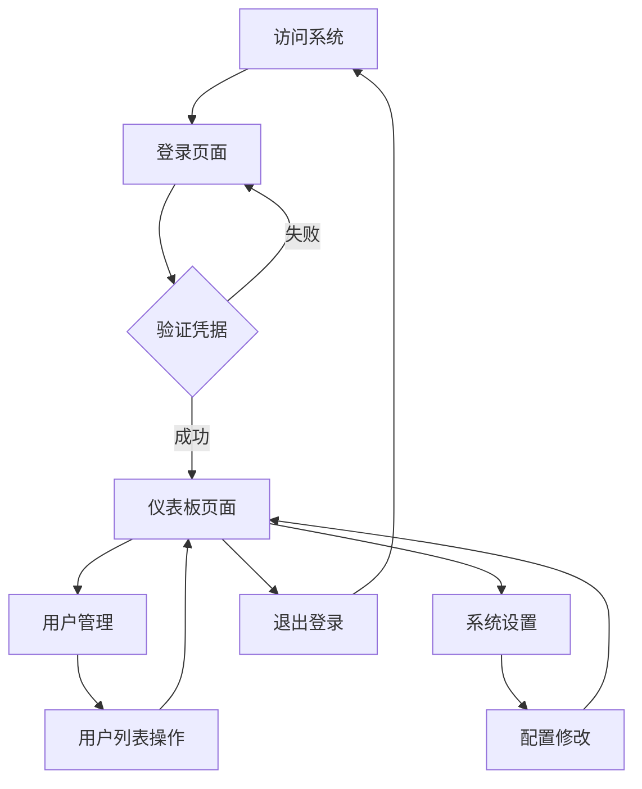

# Vue 3 后台管理系统产品需求文档

## 1. 产品概述

本项目是一个基于Vue 3技术栈的现代化后台管理系统，为管理员提供直观的数据管理和监控界面。
系统采用响应式设计，支持用户登录认证、数据可视化展示和基础的内容管理功能，帮助管理员高效处理日常运营工作。

## 2. 核心功能

### 2.1 用户角色

| 角色 | 注册方式 | 核心权限 |
|------|----------|----------|
| 管理员 | 预设账号登录 | 可访问所有功能模块，查看统计数据，管理系统设置 |

### 2.2 功能模块

本后台管理系统包含以下主要页面：
1. **登录页面**：用户身份验证、登录表单、记住密码功能
2. **仪表板页面**：数据统计概览、图表展示、快捷操作入口
3. **用户管理页面**：用户列表、用户信息编辑、用户状态管理
4. **系统设置页面**：基础配置、个人资料设置

### 2.3 页面详情

| 页面名称 | 模块名称 | 功能描述 |
|----------|----------|----------|
| 登录页面 | 登录表单 | 输入用户名和密码进行身份验证，支持记住登录状态 |
| 登录页面 | 验证提示 | 显示登录错误信息，引导用户正确输入 |
| 仪表板页面 | 统计卡片 | 展示关键业务指标：用户总数、订单数量、收入统计等 |
| 仪表板页面 | 图表区域 | 显示趋势图表：用户增长曲线、销售数据柱状图 |
| 仪表板页面 | 快捷操作 | 提供常用功能的快速入口按钮 |
| 用户管理页面 | 用户列表 | 分页展示用户信息，支持搜索和筛选功能 |
| 用户管理页面 | 用户操作 | 编辑用户信息、启用/禁用用户账号 |
| 系统设置页面 | 个人资料 | 修改管理员个人信息和密码 |
| 系统设置页面 | 系统配置 | 基础系统参数设置 |
| 布局组件 | 侧边导航 | 显示功能模块菜单，支持折叠展开 |
| 布局组件 | 顶部导航 | 显示用户信息、退出登录、面包屑导航 |

## 3. 核心流程

**管理员操作流程：**
用户访问系统 → 登录页面输入凭据 → 验证成功后进入仪表板 → 通过侧边栏导航访问各功能模块 → 执行相应的管理操作 → 完成后可退出登录

## 4. 用户界面设计

### 4.1 设计风格

- **主色调**：#409EFF（Element Plus 主蓝色），辅助色：#67C23A（成功绿）、#E6A23C（警告橙）、#F56C6C（危险红）
- **按钮样式**：圆角按钮，悬停效果，主要按钮使用品牌色
- **字体**：系统默认字体栈，标题14-16px，正文12-14px
- **布局风格**：卡片式布局，左侧固定导航，顶部面包屑导航
- **图标风格**：使用Element Plus内置图标，简洁线性风格

### 4.2 页面设计概览

| 页面名称 | 模块名称 | UI元素 |
|----------|----------|--------|
| 登录页面 | 登录表单 | 居中卡片布局，白色背景，阴影效果，蓝色主按钮 |
| 登录页面 | 背景区域 | 渐变背景或品牌色背景，提升视觉层次 |
| 仪表板页面 | 统计卡片 | 4列网格布局，白色卡片，彩色图标，数字突出显示 |
| 仪表板页面 | 图表区域 | 响应式图表容器，使用ECharts组件 |
| 用户管理页面 | 数据表格 | Element Plus表格组件，斑马纹样式，操作按钮右对齐 |
| 布局组件 | 侧边导航 | 深色背景，白色文字，选中状态高亮 |
| 布局组件 | 顶部导航 | 白色背景，右侧用户头像和下拉菜单 |

### 4.3 响应式设计

系统采用桌面优先的响应式设计，在平板和手机端自动适配。侧边栏在小屏幕设备上可折叠为抽屉式导航，确保在移动设备上的良好使用体验。