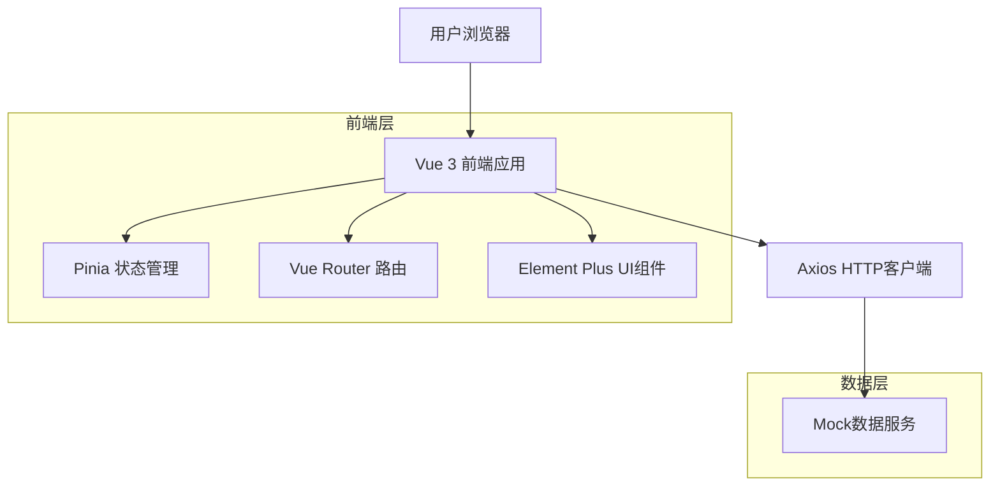
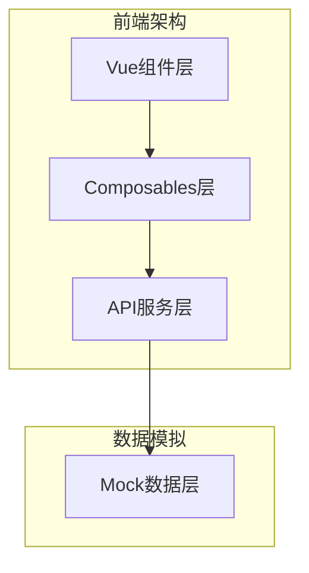
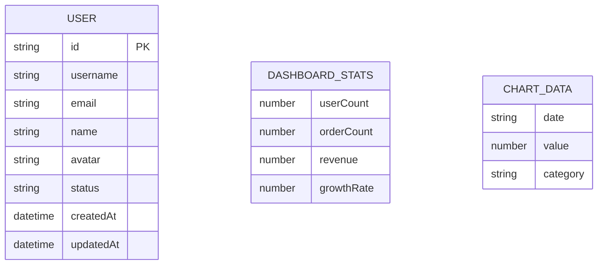

# Vue 3 后台管理系统技术架构文档

## 1. 架构设计



## 2. 技术描述

- 前端：Vue@3.5.18 + Element Plus@2.11.1 + Pinia@3.0.3 + Vue Router@4.5.1 + Axios@1.11.0 + Vite@7.0.6
- 数据：Mock假数据（本地JSON文件模拟）

## 3. 路由定义

| 路由 | 用途 |
|------|------|
| /login | 登录页面，用户身份验证 |
| / | 重定向到仪表板页面 |
| /dashboard | 仪表板页面，显示统计数据和图表 |
| /users | 用户管理页面，用户列表和操作 |
| /settings | 系统设置页面，个人资料和系统配置 |

## 4. API定义

### 4.1 核心API

用户认证相关
```
POST /api/auth/login
```

请求参数：
| 参数名 | 参数类型 | 是否必需 | 描述 |
|--------|----------|----------|------|
| username | string | true | 用户名 |
| password | string | true | 密码 |

响应参数：
| 参数名 | 参数类型 | 描述 |
|--------|----------|------|
| success | boolean | 登录是否成功 |
| token | string | 访问令牌 |
| user | object | 用户信息 |

示例：
```json
{
  "username": "admin",
  "password": "123456"
}
```

仪表板数据获取
```
GET /api/dashboard/stats
```

响应参数：
| 参数名 | 参数类型 | 描述 |
|--------|----------|------|
| userCount | number | 用户总数 |
| orderCount | number | 订单总数 |
| revenue | number | 总收入 |
| chartData | array | 图表数据 |

用户管理相关
```
GET /api/users
POST /api/users
PUT /api/users/:id
DELETE /api/users/:id
```

## 5. 服务架构图



## 6. 数据模型

### 6.1 数据模型定义



### 6.2 Mock数据结构

用户数据 (mockData/users.json)
```json
[
  {
    "id": "1",
    "username": "admin",
    "email": "admin@example.com",
    "name": "系统管理员",
    "avatar": "https://cube.elemecdn.com/0/88/03b0d39583f48206768a7534e55bcpng.png",
    "status": "active",
    "createdAt": "2024-01-01T00:00:00Z",
    "updatedAt": "2024-01-01T00:00:00Z"
  }
]
```

仪表板统计数据 (mockData/dashboard.json)
```json
{
  "stats": {
    "userCount": 1234,
    "orderCount": 5678,
    "revenue": 123456.78,
    "growthRate": 12.5
  },
  "chartData": [
    {
      "date": "2024-01",
      "value": 100,
      "category": "用户增长"
    }
  ]
}
```

登录凭据 (mockData/auth.json)
```json
{
  "validCredentials": [
    {
      "username": "admin",
      "password": "123456",
      "token": "mock-jwt-token-admin",
      "user": {
        "id": "1",
        "username": "admin",
        "name": "系统管理员",
        "email": "admin@example.com",
        "avatar": "https://cube.elemecdn.com/0/88/03b0d39583f48206768a7534e55bcpng.png"
      }
    }
  ]
}
```